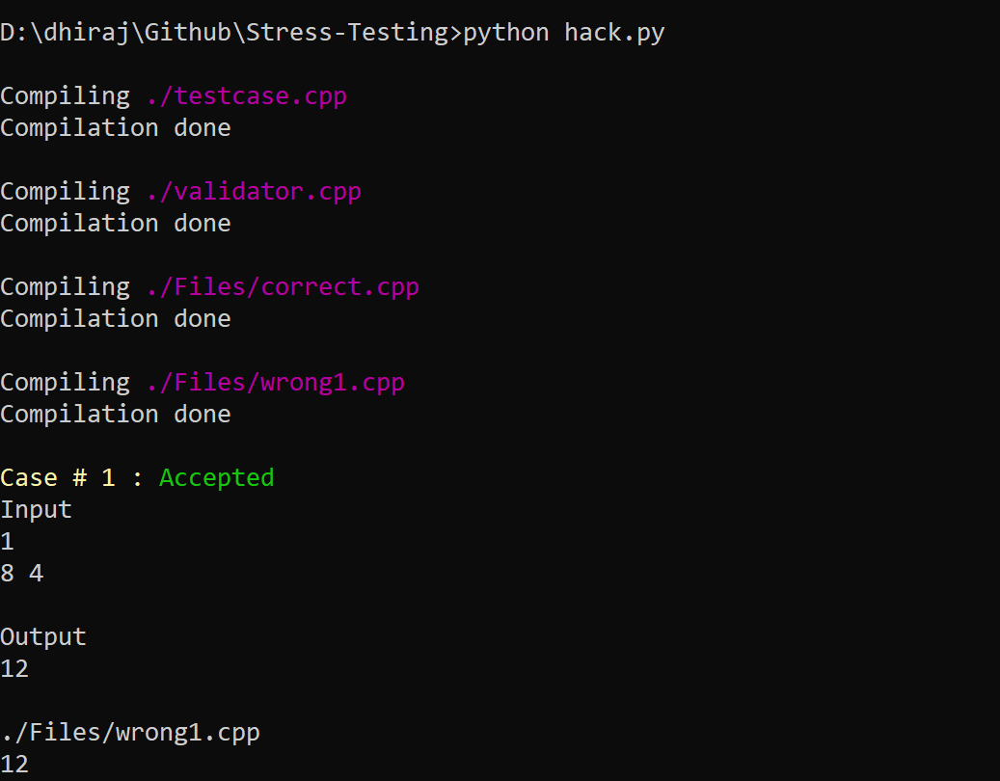
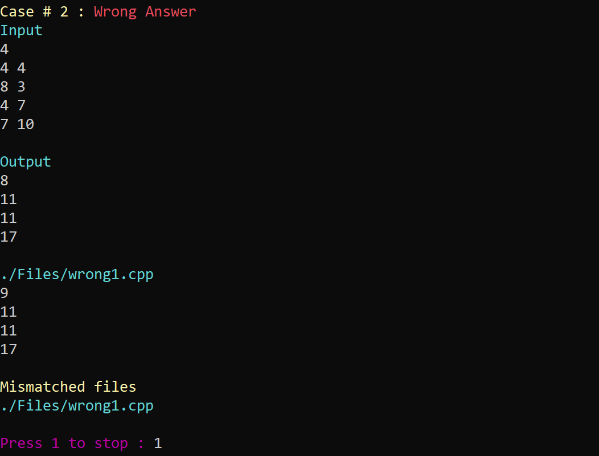

# Stress Testing

### [What is stress testing ?](https://ali-ibrahim137.github.io/competitive/programming/2020/08/23/Stress-Testing.html)

### Preview 👀



### Prerequirement
- [Python](https://www.python.org/)
- [Colorama](https://pypi.org/project/colorama/) and [Subprocess](https://docs.python.org/3/library/subprocess.html) python package
- Compiler for your language (C, C++, Java or Python)

### How to use ? 🤔
- Clone or Download this repository.
- `Files/correct.cpp` - your brute force approch or you can copy accepted code.
- `Files/wrong1.cpp`, `Files/wrong2.cpp` ... the files you want to compare / check with `Files/correct.cpp`.
- Generate testcase in `testcase.cpp` file
- Modify `hack.py` file according to number of files ..
```py
files = [
    './Files/wrong1.cpp',
    './Files/wrong2.cpp',
    # './Files/wrong3.cpp',
]
```
- Run `python hack.py`
- After getting wrong answer chekout `Files/in.txt` and `Files/out.txt`

### Bye
- Testcase generator is written in `c++`, you can also use other language but make sure to modify `hack.py` accordingly.
- Give a star⭐️ & Follow ;)