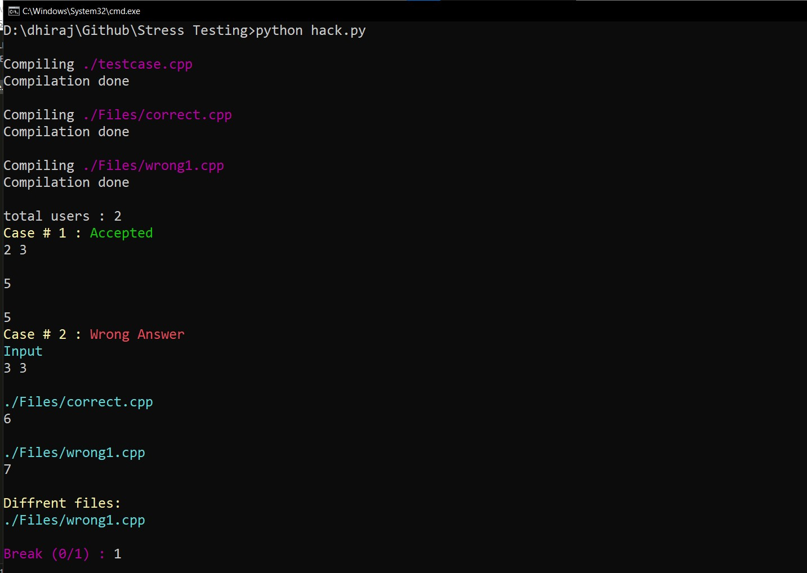

# Stress Testing using Python



### How to use ?
- `create files inside Files according to your language and add them in hack.py`
```
no_users = 2
files = [ # first file expected output
    './Files/correct.cpp',
    './Files/wrong1.cpp',
]
```
- `Generate testcase in testcase.cpp file`
- `update correct file in Files folder`
- `update wrong file in Files folder`
- `modify hack.py file according to number of user and files`
- `run => python hack.py`

```c++
if(enjoy) {
    giveStar();
    Follow();
}
```